# Код поэтапной разработки сайта-портфолио на Flask

Что представляет из себя веб-фреймворк Flask ?

__Flask__ — это легковесный веб-фреймворк на Python, предназначенный для создания веб-приложений.
Он был разработан Армином Рончи и предлагает простой и гибкий подход к разработке веб-серверов и API.
Flask использует минималистичный дизайн и не накладывает множество ограничений на структуру приложения, что делает его идеальным выбором как для начинающих, так и для опытных разработчиков.

[Готовый сайт](https://QuadDarv1ne.github.io/flask_project/)

[Первая версия сайта-портфолио](#первая-версия) | [Вторая версия сайта-портфолио](#вторая-версия)

### Первая версия:
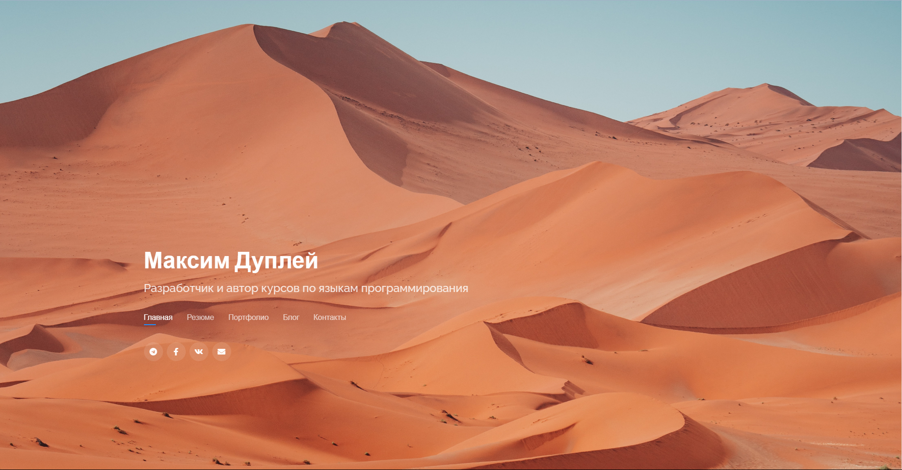
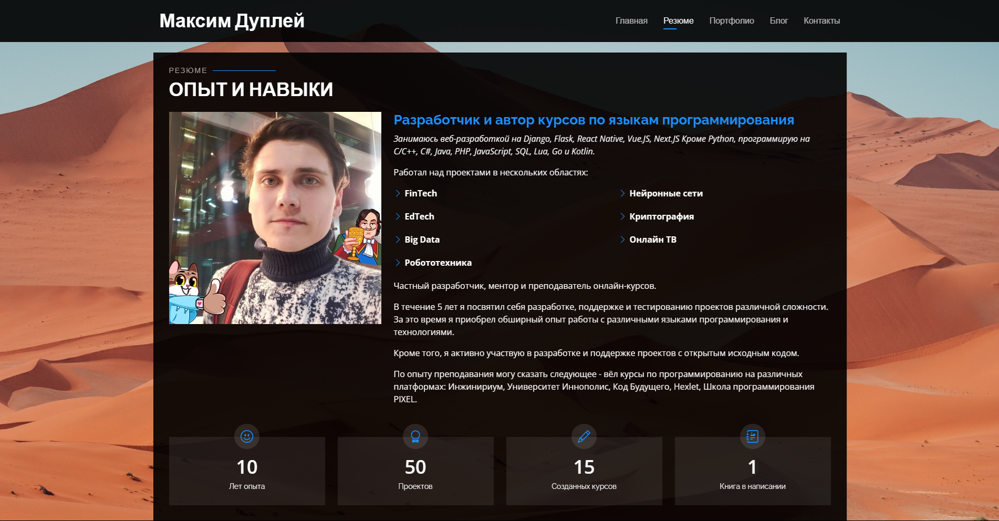
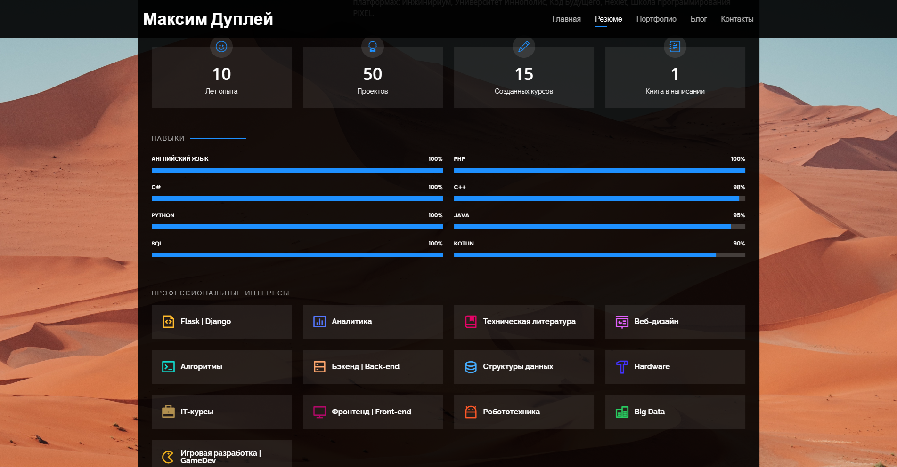
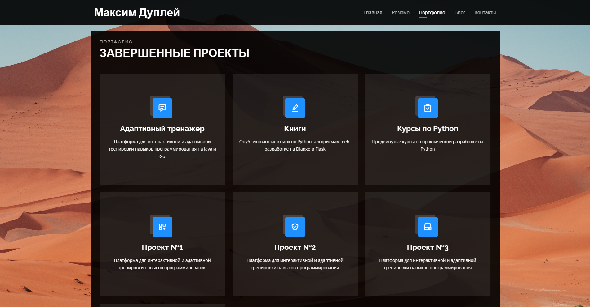
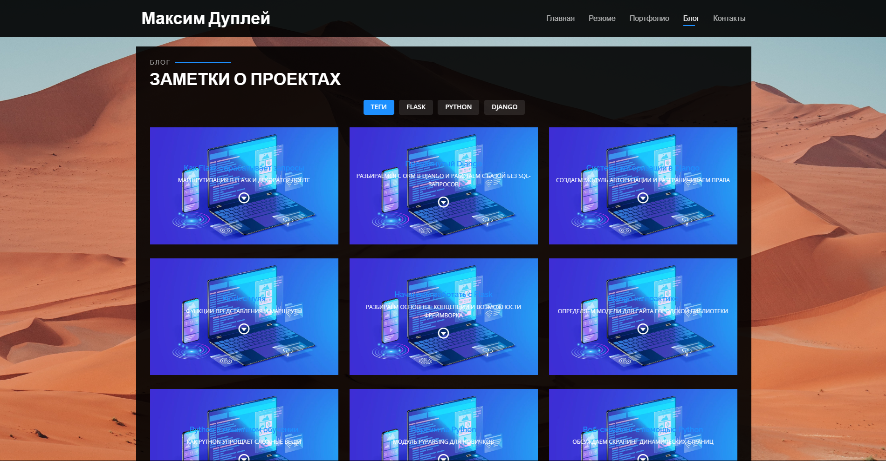
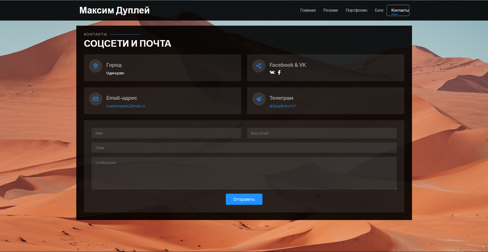
### Вторая версия:
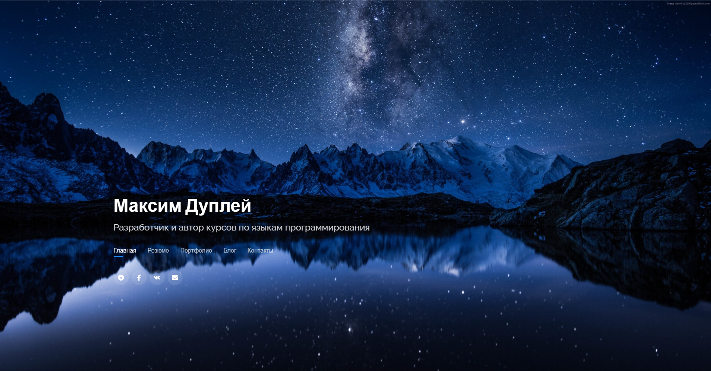
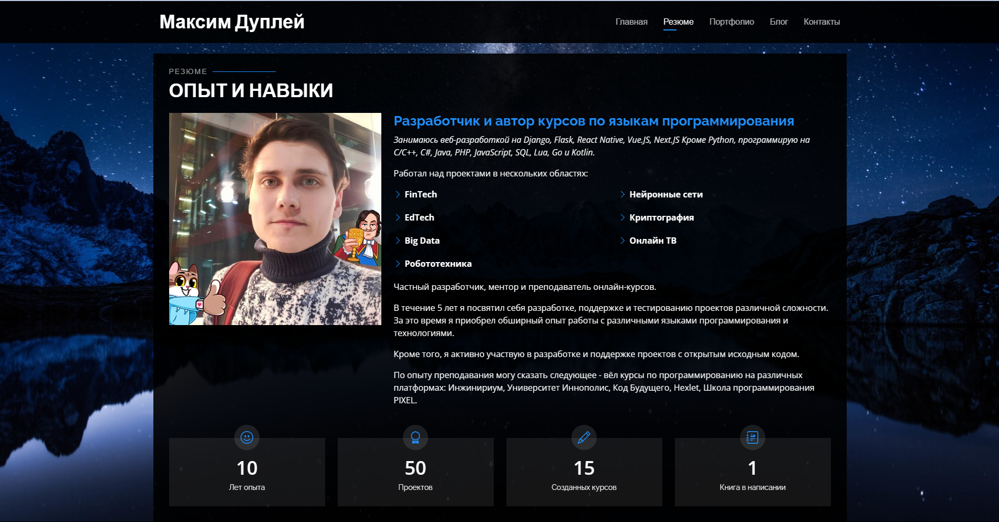
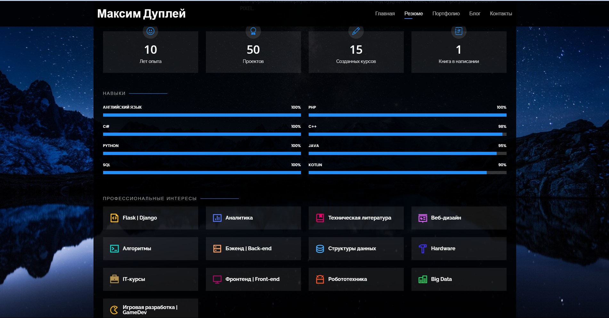
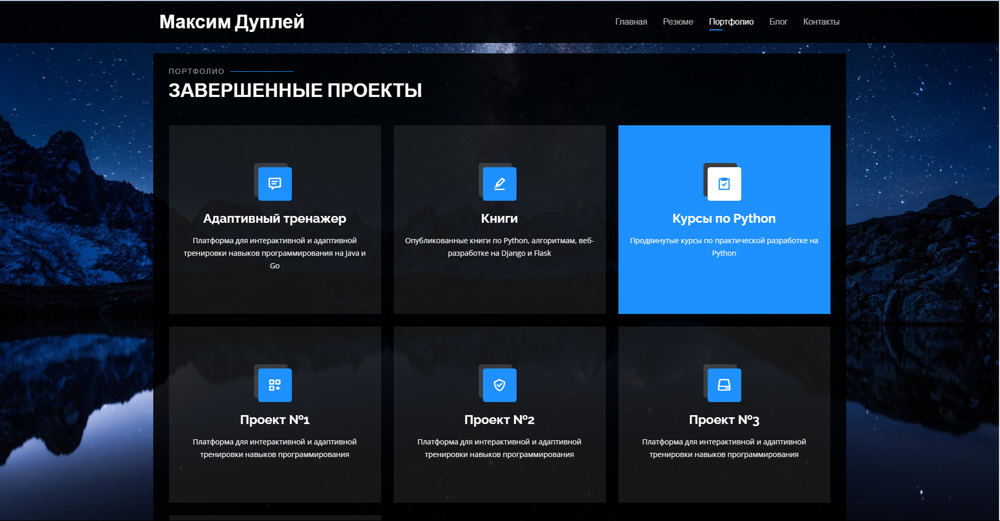
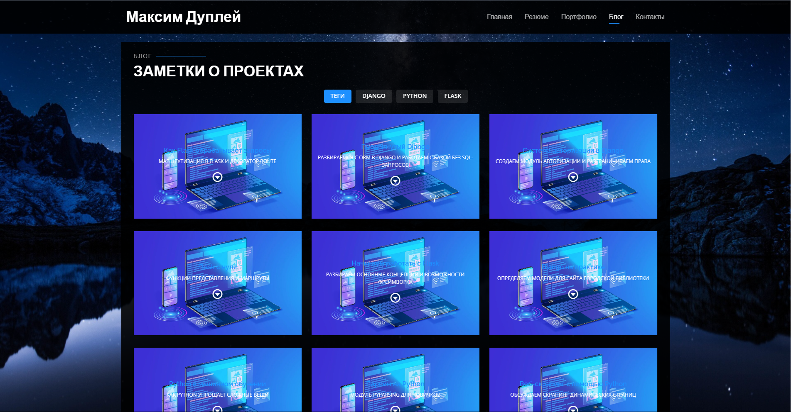
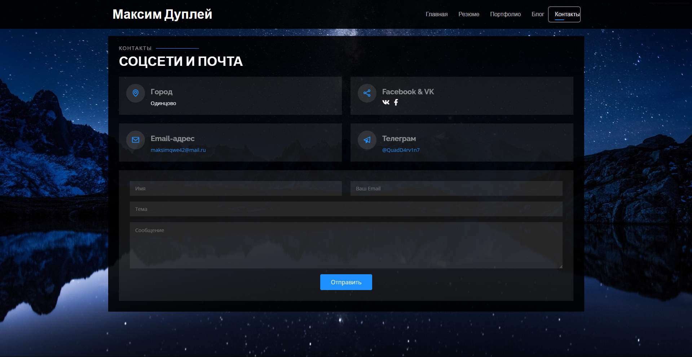

---

### Лицензия

`MIT License` - открытый код для любых целей.

---

[Telegram (первый) - Maxim Dupley](https://t.me/quadd4rv1n7)

[Telegram (второй) - Maxim Dupley](https://t.me/dupley_maxim_1999)

[Ссылка на курсы Stepik](https://stepik.org/users/150943726/profile)

**Автор:** Дуплей Максим Игоревич

**Дата:** 29.07.2024
